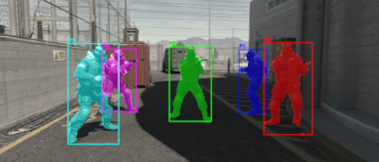
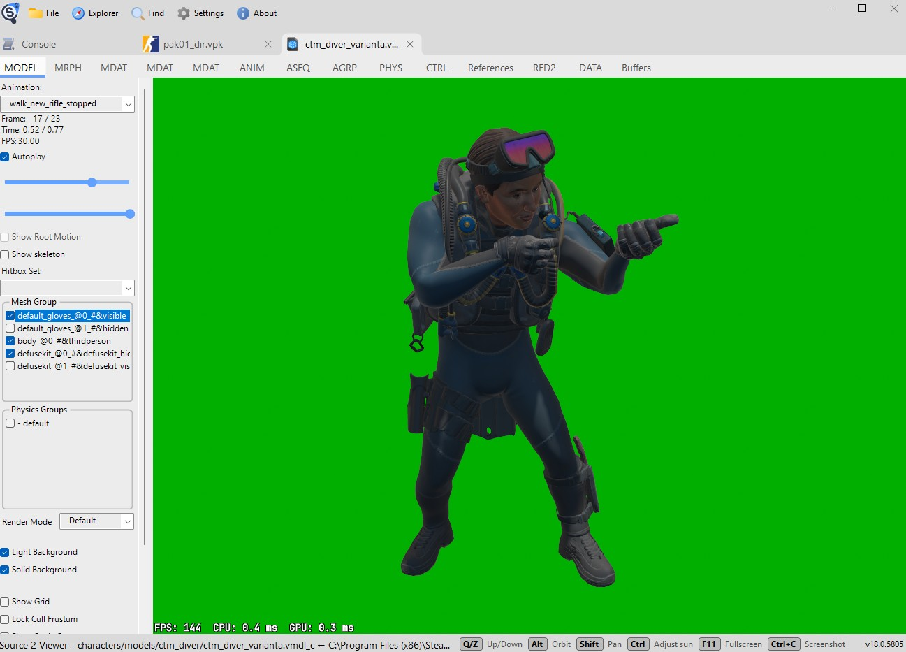

# cs2player-seg


A trained YOLO model for segmenting Counter-Strike 2 players



## Usage

```python
from ultralytics import YOLO

# Load model
model = YOLO('cs2_player_segmentation.pt')

# Run inference on image
results = model('example.jpg')

# Show results
results[0].show()

# Export results
results[0].save('result.jpg')
```

For more information please refer to [YOLO documentation](https://docs.ultralytics.com/)

## Training process

The model is trained on synthetically generated CS2 player masks using in-game models and animations extracted using [Source 2 Viewer](https://github.com/ValveResourceFormat/ValveResourceFormat):


